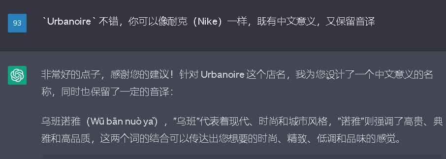

*本文档想法来源于B站up主36氪视频：BV15v4y1E7zV*
## 开通淘宝店铺

### 注册淘宝并开通商铺
1. 打开 [淘宝官网](https://www.taobao.com/) , 点击右上角免费开店，从`普通商家` `达人商家` `品牌商家` 选择，淘宝默认选择是 `普通商家` ，不做任何修改。
2. 选择 `个人商家` 卡片下方的去开店，等待右侧弹窗。
3. 填写基本信息，网址会重定向到 `千牛` ，淘宝使用它来核实信息。

### *使用chatgpt来生成店铺名字*

在填写基本信息时，需要填写商铺名字，可以用 `chatgpt` 来帮助你生成名字 `chatgpt`，像是一个你的助理，她可能什么都懂，但是处理事务细节不到位，你需要对她下达详细的指令。

目前Elavis Saravia的总结是最受人认可的一套公式或者说framework：
- `Instruction`（必须）： 指令，即你希望模型执行的具体任务。
- `Context`（选填）： 背景信息，或者说是上下文信息，这可以引导模型做出更好的反应。
- `Input Data`（选填）： 输入数据，告知模型需要处理的数据。
- `Output Indicator`（选填）： 输出指示器，告知模型我们要输出的类型或格式。

通常写prompt的时候也不必完全使用这个，比较通用的是且好记的是 `身份赋予法`，即赋予chatgpt一个身份，然后告诉他这个身份面临的问题，最后让他去解决问题。

- 将赋予身份和告诉它身份面临的情况，这可以当作是 `Instruction` 和 `Context`
- 面临情况时，我们可能会附带参数，这可以当作是 `Input Data`
- 最后解决完问题可以要求将结果输出为 markdown、table 之类的，或者干脆将它当作参数再进行加工。 `Output Indicator`

下面举例子，我在chatgpt里输入: 

`你是一个服装厂的设计师，现在厂打算在淘宝开一家网店，需要设计是个更现代、更时尚的店名`

我们选择第一个，然后告诉 `chatgpt` ：

`Urbane Attire不错，但是还是不够好听，你继续迭代这个词，列出是个你新生成出来的词，并把它们翻译一个信达雅的中文名字，`

然后就得到了：`Urbanoire` 和 `雅黑坊`，雅黑坊没有包含音译，感觉差点意思，我们继续输入：

`Urbanoire 不错，你可以像耐克（Nike）一样，既有中文意义，又保留音译`

最后我们就用 `乌班诺雅` `Urbanoire` 作为店铺名字 

具体 `chatgpt promp` 参考学习拓展的资料可以参考 https://learningprompt.wiki/ 
### 装修淘宝店铺
