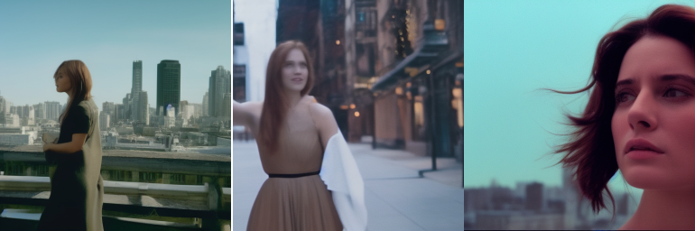
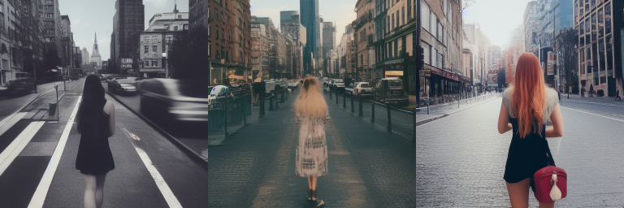
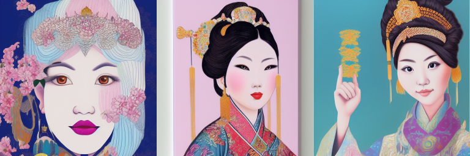

*本文来源于官网的 https://stable-diffusion-art.com/illustrated-guide/ 文章的个人实践*

## 前言

在社交平台上，专门发布 `stable-diffusion` 内容的博主，他们生成的图像大都是风格类似的。当然这得益于 `模型` 定制生成出图，但是可以通过 `prompt` 去控制出图风格。

本篇文章将会使用基础的 stable-diffusion 1.5 模型去生成测试

官网的教程将影响出图艺术效果的分为四种

- `Art Medium`（艺术媒介）
- `Artist`（艺术家）
- `Style` （风格）
- `Character`（角色）


## Art Medium
教程举出的 `Art Medium` 的例子很多：

|中文|English|
|-|-|
|黑白照片|black and white photo|
|宝丽来|Polaroid|
|电影剧照|Movie still|
|纹身艺术|Tattoo art|
|像素艺术|Pixel art|
|贴纸插图|Sticker illustration|
|弹出式卡片|Pop-up paper card|

### Movie still
这里使用 `Movie still` 来进行测试，教程给出的 `prompt` 是：

`Movie still of a beautiful woman/city.`

下面是效果图片和输入的参数


``` txt
Movie still of a beautiful woman/city.
Steps: 20, Sampler: Euler a, CFG scale: 7, Seed: 1446965126, Size: 512x512, Model hash: 6ce0161689, Model: v1-5-pruned-emaonly, Clip skip: 2, ENSD: 31337

Time taken: 5.20sTorch active/reserved: 3169/3692 MiB, Sys VRAM: 5569/6144 MiB (90.64%)
```

这里我们看到图像质量并不可控，但是风格化实现了。

我们去除 `Movie still` ，来做个对比



```
a beautiful woman/city
Steps: 20, Sampler: Euler a, CFG scale: 7, Seed: 3809708424, Size: 512x512, Model hash: 6ce0161689, Model: v1-5-pruned-emaonly, Clip skip: 2, ENSD: 31337

Time taken: 5.28sTorch active/reserved: 3169/3692 MiB, Sys VRAM: 5569/6144 MiB (90.64%)
```

通过对比我们不难发现，`Movie still` 会给予画面一种电影镜头感，作为其他不加参数对比项的画面则会出现其他包括 `Movie still` 在内的 `Art Medium` 效果，其他类型的风格提示词与之相比使用方式都差不多，下面都不在赘述了。

## Artist 
|中文|English|
|-|-|
|阿尔方斯·穆夏|Alphonse Mucha|
|约翰·科利尔|John Collier|
|村上隆|Takashi Murakami|
|萨尔瓦多·达利|Salvador Dali|
|约翰·辛格·萨金特|John Singer Sargent|
|布拉德·里格尼|Brad Rigney|
|安德鲁·沃霍尔|Andrew Warhol|
|安卓琼斯|Android Jones|

## Style 
|中文|English|
|-|-|
|水彩|Watercolor|
|数字艺术贝汉斯|Digital art Behance|
|学院派绘画|Academicism painting|
|波普艺术|Pop-art|
|超现实主义绘画|Surrealism painting|
|装饰艺术插图|Art deco illustration|
|前卫绘画|Avant-garde painting|
|古典主义绘画|Classicism painting|
|欧普艺术|Op Art|

## Character

角色可以某种知名人物，亦或是身份职业
|中文|English|
|-|-|
|剪刀手爱德华|Edward Scissorhands|
|杰克船长|Captain Jack|
|建筑工人|Construction worker|
|中国公主|Chinese Princess|

## 将多种结合在一起进行绘图

我们使用 `Surrealism painting`（超现实主义绘画）+ `Chinese Princess`（中国公主）+ `Sticker illustration`（贴纸插图）作为风格 `prompt` 来生成独特风格的图像

`Surrealism painting of a girl as Chinese Princess by Sticker illustration`



```
Surrealism painting of a girl as Chinese Princess by Sticker illustration
Steps: 20, Sampler: Euler a, CFG scale: 7, Seed: 3781634137, Size: 512x512, Model hash: 6ce0161689, Model: v1-5-pruned-emaonly, Clip skip: 2, ENSD: 31337

Time taken: 5.27sTorch active/reserved: 3178/3702 MiB, Sys VRAM: 5595/6144 MiB (91.06%)
```

## 总结

通过 `prompt` 可以实现 `stable-diffusion` 生成风格化图像，但是图像质量需要通过其他描述词来限定，比如 `8k`，`high quality` 等等。

当我们使用 `stable-diffusion` 生成我们所期望的图像之后，可以考虑使用 `ai-upscaler` 来提升画面精细度。

