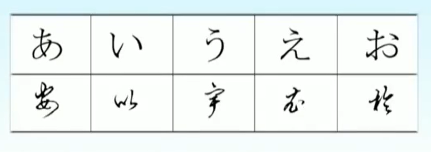
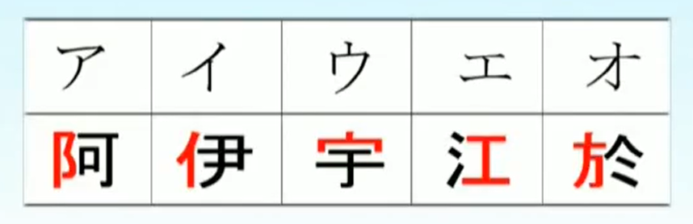

# 假名与五十音
日语文字由假名和汉字组成
## 平假名和片假名
日语钟的假名是日本人长期使用汉字后，在汉字的基础上创造的 `表音文字`
平是通俗易懂的意思
片是部分不完整的意思
### 平假名
`平假名` 是在汉字草书字体的基础上衍生出来的

### 片假名
`片假名` 则是取自汉字的一部分

## 五十音图
||あ段|い段|う段|え段|お段|
|-|-|-|-|-|-|
|あ行|あ|い|う|え|お|
|ｋ行|か|き|く|け|こ|
|ｓ行|さ|し|す|せ|そ|
|ｔ行|た|ち|つ|て|と|
|ｎ行|な|に|ぬ|ね|の|
|ｈ行|は|ひ|ふ|へ|ほ|
|ｍ行|ま|み|む|め|も|
|ｙ行|や|い|ゆ|え|よ|
|ｒ行|ら|り|る|れ|ろ|
|ｗ行|わ|い|う|え|を|
|ｇ行|が|ぎ|ぐ|げ|ご|
|ｚ行|ざ|じ|ず|ぜ|ぞ|
|ｄ行|だ|じ|ず|で|ど|
|ｂ行|ば|び|ぶ|べ|ぼ|
|ｐ行|ぱ|ぴ|ぷ|ぺ|ぽ|

## 拗音、半元音、拨音

1. 拗音：  `い段假名` 和 复元音 `や、ゆ、よ` 组成

2. 拨音：  `ん`
    - ぱ、ば、ま，[m]:　さんぽ、
    - た、だ、ら、な,[n]
    - 其他，[ng]

3. 浊音：  g、z、d、b；半浊音：p

4. 长音：  

5. 促音：  `つ`，

元音辅音五十音拗音特殊音波音长音促音