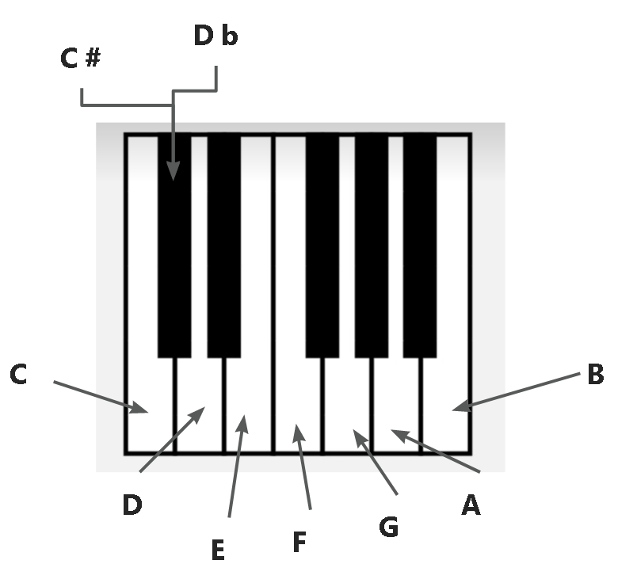
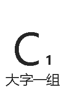
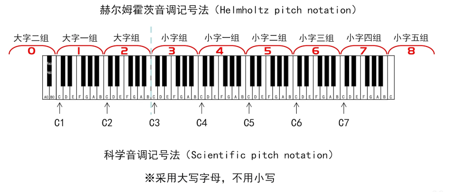
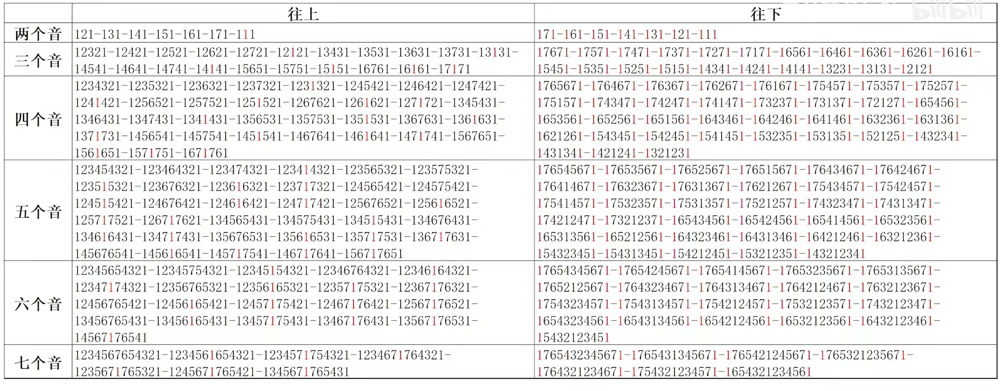

## 调号篇

### 唱名
1 2 3 4 5 6 7   => do re mi fa sol la si  

### 调号

1. 调号的公式  ：调号 ==（1 = C ）  == （ 唱名 = 音名 ）
### 音名

##### 音名 

1. 音名 ： 就是 C D E F G A B  ,  从左到右依次对应下图

2.  黑白键
   1. 白键 ： C D E F G A B
   2. 黑键 ： 
      1. 升调 ： sharp  #
      2. 降调 ： b

3. 等音
   1. 也就是一个音的另一种叫法
   2.  C # 就是 D b 的等音
4. 重升与重降
   1. 重升 X  
   2. 重降 bb
   3. Q：为什么要用重升与重降呢   A：在音乐语境时能更快更直观

### 音调

#### 音调记号法

##### 一、赫尔姆霍茨音调记号法 

1. 大字组 的 音名需要大写，小字组的音名需要小写
2. 大字或小字的其他组则在右下方标记数字，如下图所示

##### 二、科学音调记号法 

#### 高低音
每过一组依次加一个点，高音在上，低音在下 

### 音域

1. 音域是每个乐器能发出的声音范围

### 半音与全音

1. 二者是一个距离单位，半音是相邻的两个音之间的距离，全音则是半音的两倍
2. C 和 C# 它们二者之间的距离是一个半音
3. C 和 D 它们二者之间的距离是一个全音

### 乐音 与 噪音

1. 前者振动规则，频率稳定
2. 后者振动不规则，频率不稳定

### 乐音体系
乐音体系是指：音乐中使用到的所有乐音的总和 ，88 、97

### 音列
在乐音体系中，取若干乐音，并有序地排列起来的，称为音列

### 音级
乐音体系中的每一个音，都叫音级

##### 一、基本音级：
CDEFGAB

##### 二、变化音级：
只要是使用了 升降号 的音，就是变化音级

1. 升号：C# D# E＃ F# G# A# B# 
2. 降号：Cb Db Eb Fb Gb Ab Bb
3. 重升号：Cx Dx Ex Fx Gx Ax Bx 
4. 重降号：Cbb  Dbb  Ebb  Fbb  Gbb  Abb  Bbb

### 自然半音、自然全音、变化半音、变化全音

1. 自然与变化只看音名，连续的两个音名是自然。 C D ， D#E
2. 半音全音是距离。

### 调式

### 调性
调性就是 主音 ＋ 调式

### 音阶 

#### 是什么音阶
将调式中的音，从以主音开始到以主音结束，由低到高（上行），或由高到低（下行），以阶梯状排列起来，就叫音阶

1. 以主音开始，以主音结束	（有始有终）
2. 音阶是有序的	（有序）
3. 包含该调式的所有音	（完整）

#### 音阶的意义

1. 浓缩信息，简化说法
2. 五线谱多以音阶表现

## 调号练习篇

### 唱名记忆

##### 意义
基础之中的基础，类 数字之于数学 ， 汉字之于语文

##### 做法
随便写几个音，或多，或少，每日大量练习，达到见数知音即可

### 模唱

##### 意义
培养相对音高的感觉

##### 做法

1. 两个音 ， 往上，往下，模唱
2. 只谈do，现场，再弹琴检验
3. 依次增加音的数量，重复一二步骤
4. 换一个调，重复以上所有步骤

